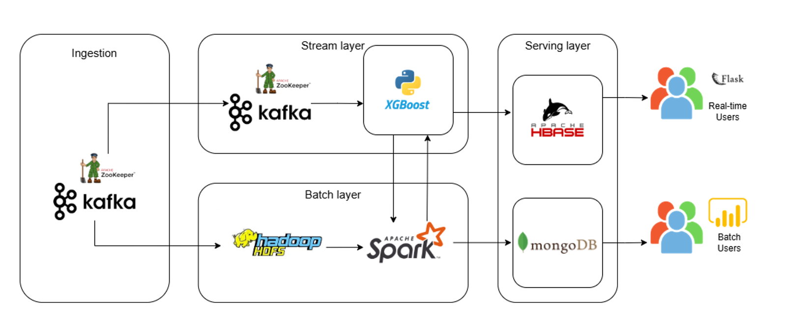

# Phone Price Prediction Data Pipeline

## Mô tả dự án

Dự án này là thành quả của [nhóm](https://docs.google.com/document/d/1aCBQKL88VoqWi6-7sXHwsxA4zfIW-APWjIFQYpa099o/edit?usp=sharing) trong môn học Kỹ thuật và công nghệ dữ liệu lớn (2425II_INT3229_1). Nhóm xin gửi lời cảm ơn chân thành đến các thầy cô đã tận tình hướng dẫn, cung cấp những phản hồi quý giá và luôn đồng hành với chúng em trong suốt quá trình thực hiện dự án.

Dự án này được xây dựng với mục tiêu chính là phát triển một hệ thống hoàn chỉnh cho bài toán dự đoán giá điện thoại thông minh theo kiến trúc Lambda. Hệ thống bao gồm đầy đủ các giai đoạn của một quy trình xử lý dữ liệu lớn, từ thu thập dữ liệu thô, tiền xử lý, xây dựng và huấn luyện mô hình học máy, đến triển khai mô hình để đưa ra dự đoán và lưu trữ kết quả, phục vụ cho cả Stream users và Batch users.

Các công nghệ chính được sử dụng:
*   Apache Kafka, Spark, HBase, HDFS, MongoDB/MongoDB Atlas
*   XGBoost, Flask, Docker, Docker Compose, Python

## Cài đặt và Chạy dự án

1.  **Yêu cầu**: Cài đặt Docker và Docker Compose.

2.  **Khởi chạy hệ thống & Job xử lý Batch chính**:
    *   Di chuyển vào thư mục `Main/`.
    *   Có thể thay đổi `docker-compose.yml` để tùy chỉnh cấu hình chạy.
    *   Chạy lệnh: `docker-compose up -d`
        *Lệnh này sẽ khởi chạy tất cả dịch vụ và tự động chạy job Spark batch để xử lý dữ liệu từ HDFS và lưu kết quả vào MongoDB.*

3.  **Kiểm tra & Theo dõi**:
    *   Kết quả dự đoán sẽ có trong MongoDB.
    *   Giao diện Flask: `http://localhost:5001`
    *   Các giao diện khác (Hbase, Spark, HDFS,...) có thể tìm thấy trong danh sách container của Docker.

4.  **Các tác vụ tùy chọn (chạy thủ công)**:
    *   Xem chi tiết cách chạy các thành phần này trong các thư mục tương ứng. Các script này cần được chạy riêng và có thể yêu cầu cấu hình biến môi trường cụ thể (ví dụ `HBASE_HOST=hbase` cho các script kết nối HBase từ Docker).
